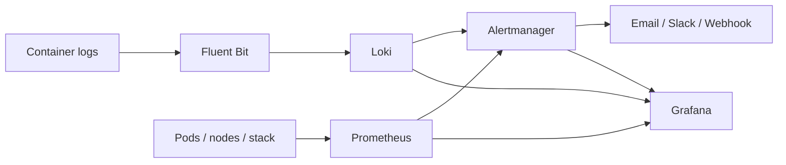

# Observability Stack

A Helm chart that deploys **Prometheus, Alertmanager, Loki, Fluent Bit and Grafana** on Kubernetes, already connected to each other, with all data stored in a **local directory** on the node.

Runs on **RHEL / Rocky / AlmaLinux / CentOS** and **Ubuntu / Debian**.



## Features

- **Logs:** Fluent Bit collects every container log and sends it to Loki, labelled by namespace, pod, container and node.
- **Metrics:** CPU, memory, network and throttling for every pod and node, plus health of all stack components.
- **Alerts:** 21 built-in rules (pod CPU/memory, OOM kills, crash loops, node pressure, error logs, stack health) delivered by email, Slack or webhook.
- **Dashboards:** an overview (alerts, health, log search) and a pod resource utilization dashboard.
- **Local storage:** everything under `/data/observability`. Data survives restarts, upgrades and uninstall.
- **One-command install:** detects the OS, SELinux, firewalld or ufw, and single or multi-node clusters.

## Quick start

```bash
git clone https://github.com/<your-user>/observability-stack.git
cd observability-stack

cp my-alert-values.example.yaml my-alert-values.yaml
vi my-alert-values.yaml          # set Grafana password, optional email/Slack

sudo ./scripts/install.sh
```

Requirements: a Kubernetes cluster (1.25+), `kubectl` with admin access, and root on the node. Helm is installed automatically if missing.

## Access

| UI | URL | Login |
|---|---|---|
| Grafana | `http://<node-ip>:30300` | `admin` / your password |
| Alertmanager | `http://<node-ip>:30903` | none |
| Prometheus | `kubectl -n monitoring port-forward svc/obs-observability-stack-prometheus 9090:9090` | none |

## Common tasks

```bash
sudo ./scripts/install.sh --dry-run        # preview changes
sudo ./scripts/install.sh --node worker-1  # multi-node: store data on worker-1
sudo ./scripts/prepare-node.sh             # run on every other node (multi-node)

git pull && sudo ./scripts/install.sh      # update to the latest version
sudo ./scripts/uninstall.sh                # remove (keeps data)
sudo ./scripts/uninstall.sh --purge-data   # remove everything
```

Settings (thresholds, retention, receivers, ports) are in [`observability-stack/values.yaml`](observability-stack/values.yaml). Override them in `my-alert-values.yaml`.

## Repository layout

```
observability-stack/          Helm chart (templates, values, dashboards)
scripts/                      install.sh, prepare-node.sh, uninstall.sh
docs/DOCUMENTATION.md         full documentation
docs/GITHUB-GUIDE.md          push, deploy and update with Git
my-alert-values.example.yaml  template for your private settings
```

> ⚠️ `my-alert-values.yaml` holds passwords and is git-ignored. Never commit it.

## Documentation

- **[Full documentation](docs/DOCUMENTATION.md):** architecture, configuration, all alert rules, dashboards, RHEL vs Ubuntu, troubleshooting.
- **[GitHub guide](docs/GITHUB-GUIDE.md):** push, deploy to servers and the everyday update workflow.
